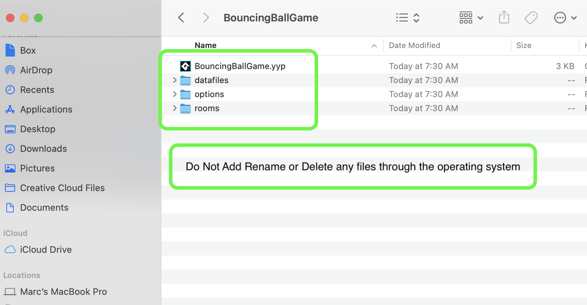

### New GML Project

Create a new project using the GameMaker Scripting Language (GML).

| `required.software`\|`GMS2 New GML Project`| 
| :--- |
| :floppy_disk: &nbsp; &nbsp; You will need to install the latest version of _GameMaker _ by downloading and installing it from  [YoYo Games](https://www.yoyogames.com/en/gamemaker). It may also be convenient to have [GitHub](https://github.com/) account which is free to sign up for as we will be using this for version control. If you are on a PC you will have to download and install [git](https://git-scm.com/downloads) (on a mac it may prompt you to install git as well but you can do it through the terminal). We will also install [Github Desktop](https://desktop.github.com) as it provides a GUI interface so you don't have to worry about command line.|

---

##### `Step 1.`\|`ITA`|:small_blue_diamond:
*Run* **GameMaker Studio 2** to launch the software.  Login with the user name you created.<kbd> </kbd>

##### `Step 2.`\|`FHIU`|:small_blue_diamond: :small_blue_diamond: 
We will start a new project (or load up an existing one if we are continuing work). Press the <kbd>New</kbd> button to create a new project.

##### `Step 3.`\|`ITA`|:small_blue_diamond: :small_blue_diamond: :small_blue_diamond:

All the walk throughs I am writing will be using the **GameMaker Lanuguage (GML)** so press the <kbd>GameMaker Language</kbd> button.

##### `Step 4.`\|`ITA`|:small_blue_diamond: :small_blue_diamond: :small_blue_diamond: :small_blue_diamond:

Now you will select a directory and a name for the project.  You can also create it in an existing **Git/GitHub** repository which I am doing here.  Press the <kbd>Save</kbd> button.

##### `Step 5.`\|`ITA`| :small_orange_diamond:

This will take you to an empty project window in the main game editor.

##### `Step 6.`\|`ITA`| :small_orange_diamond: :small_blue_diamond:

Now the folder that holds the project is named with the same name as the project in the folder you selected prior to this step.

##### `Step 7.`\|`ITA`| :small_orange_diamond: :small_blue_diamond: :small_blue_diamond:
The **GameMaker** folder will contain a `.yyp` file which is the project file.  This is just a text file and the actual contents it needs are in the folders.  **Do Not** rename, delete or add any files through the finder/explorer/operating system.  **Do Not** rename the project file through finder/explorer/operating system. All changes need to be made in the editor. To change the name of the project go to the [Change Project Name]() snippet.

##### `Step 8.`\|`ITA`| :small_orange_diamond: :small_blue_diamond: :small_blue_diamond: :small_blue_diamond:

Select the **File | Save Project** then press **File | Quit** to make sure everything in the game is saved. Open up **GitHub Desktop** and select the project you are working on.  Add a **Commit Title** and **Description**.  Press the <kbd>Commit to main</kbd> button.  Then press the <kbd>Publish branch</kbd> (very first commit) or <kbd>Push branch</kbd> (every subsequent push) to upload all changes to the server.

##### `Step 9.`\|`ITA`| :small_orange_diamond: :small_blue_diamond: :small_blue_diamond: :small_blue_diamond: :small_blue_diamond:

##### `Step 10.`\|`ITA`| :large_blue_diamond:

##### `Step 11.`\|`ITA`| :large_blue_diamond: :small_blue_diamond: 

##### `Step 12.`\|`ITA`| :large_blue_diamond: :small_blue_diamond: :small_blue_diamond: 

##### `Step 13.`\|`ITA`| :large_blue_diamond: :small_blue_diamond: :small_blue_diamond:  :small_blue_diamond: 

##### `Step 14.`\|`ITA`| :large_blue_diamond: :small_blue_diamond: :small_blue_diamond: :small_blue_diamond:  :small_blue_diamond: 

##### `Step 15.`\|`ITA`| :large_blue_diamond: :small_orange_diamond: 

##### `Step 16.`\|`ITA`| :large_blue_diamond: :small_orange_diamond:   :small_blue_diamond: 

##### `Step 17.`\|`ITA`| :large_blue_diamond: :small_orange_diamond: :small_blue_diamond: :small_blue_diamond:

##### `Step 18.`\|`ITA`| :large_blue_diamond: :small_orange_diamond: :small_blue_diamond: :small_blue_diamond: :small_blue_diamond:

##### `Step 19.`\|`ITA`| :large_blue_diamond: :small_orange_diamond: :small_blue_diamond: :small_blue_diamond: :small_blue_diamond: :small_blue_diamond:

##### `Step 20.`\|`ITA`| :large_blue_diamond: :large_blue_diamond:

##### `Step 21.`\|`ITA`| :large_blue_diamond: :large_blue_diamond: :small_blue_diamond:

___

| [previous](../)| [home](../README.md#user-content-gms2-snippets) | [next](../)|
|---|---|---|
