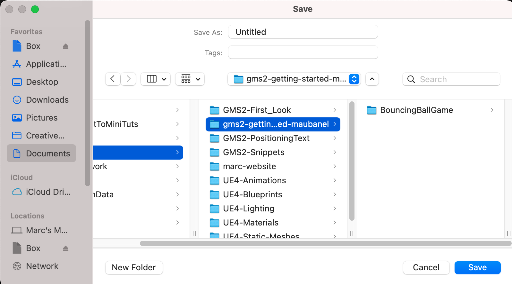

### Rename GMS2 Project

How to *rename* a project in **GameMaker Studio 2**.

 

---

##### `Step 1.`\|`ITA`|:small_blue_diamond:

Do not change the project name by editing it in the finder/explorer on windows or mac.  Instead open up the project in **GameMaker Studio 2**.

##### `Step 2.`\|`FHIU`|:small_blue_diamond: :small_blue_diamond: 

Select the **File | Save Project** to make sure all of your work is saved.

##### `Step 3.`\|`ITA`|:small_blue_diamond: :small_blue_diamond: :small_blue_diamond:

Select **File | Save Project As** and I am putting it in the same directory as the one with the old name.  My previous name was **BouncingBallGame** but now I will call it `NewProjectName`.  I will finish by pressing the <kbd>Save</kbd> button.

##### `Step 4.`\|`ITA`|:small_blue_diamond: :small_blue_diamond: :small_blue_diamond: :small_blue_diamond:

Now you will have two identical copies of the same project, one with the old name and the other with the new name.

##### `Step 5.`\|`ITA`| :small_orange_diamond:

##### `Step 6.`\|`ITA`| :small_orange_diamond: :small_blue_diamond:

Open up the project with the new name and make sure it is correct.  *Delete* the old project folder and you are ready to proceed with the project now newly named.

| `gms2.rename-project`\|`THE END`| 
| :--- |
| **That's All Folks!** That's it for this snippet. |

___

